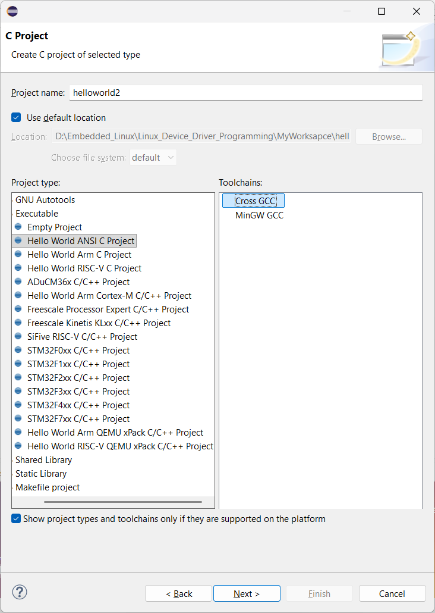

# Setup Eclipse for Beagebone black
## I. Installation
- [Install Eclipse](https://www.eclipse.org/downloads/packages/release/2025-09/r/eclipse-ide-cc-developers)
- [Install Tool Chain](https://releases.linaro.org/components/toolchain/gcc-linaro/)
- [Install Make](https://gnuwin32.sourceforge.net/packages/make.htm)
- [Install JDK](https://www.oracle.com/java/technologies/downloads/)
## II. Setup Enviroment
- Eclipse > chọn Workspace > file > new C/C++ Project > C managed build
- Điền Project name > Hello World ANSI C Project & Arm Cross GCC > next

- Điền nội dung của Basic Setting
- Select Configuration > advanced setting > PATH > Edit > thêm `;` và đường đẫn tuyệt dối đến `.\gcc_linaro_arm_linux_gnueabihf\bin` > apply
- Cross GCC Command:
    - Cross Compiler Prefix : `arm-linux-gnueabihf-`
    - Cross Compiler Path: đường dẫn tuyệt dối đến `.\gcc_linaro_arm_linux_gnueabihf\bin`
- finish
## III. SSH server từ Windows đến BBB