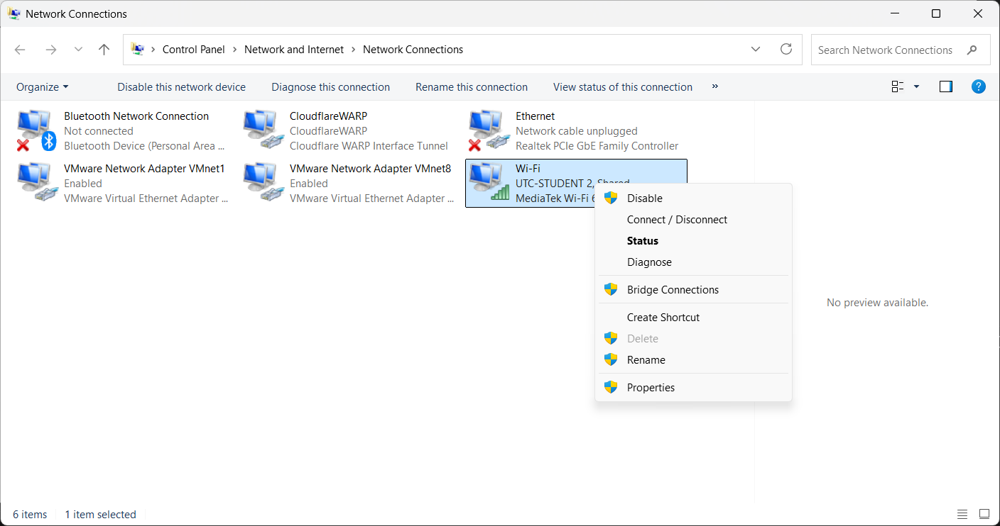
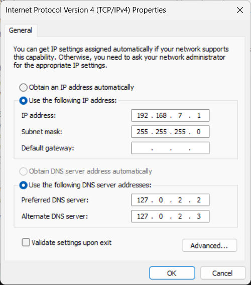

# Setup Wifi qua USB cap cho Beaglebone black
## I. Windows
- control Panel > Network and Internet > Network and Sharing Centrel > Change adapter setting

- chọn nguồn mạng muốn share > properties 


- share > Chọn mạng share


- IP bbb > properties


- Điền giá trị như trên 

## II. Ubuntu

## III. Beaglebone black
``` shell
sudo route add đefault gw 192.168.7.1 usb0

echo -e "nameserver 8.8.8.8\nnameserver 8.8.4.4" | sudo tee /etc/resolv.conf
```