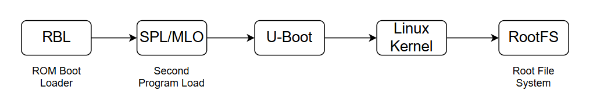
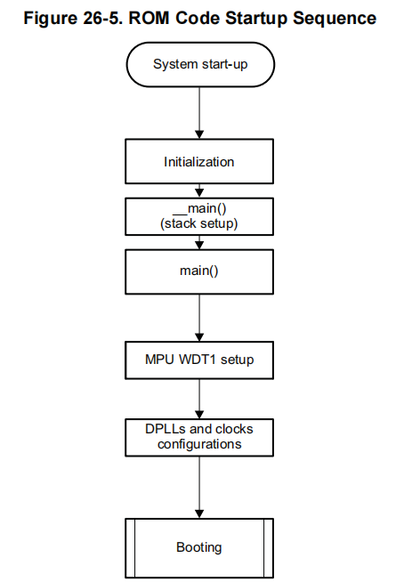
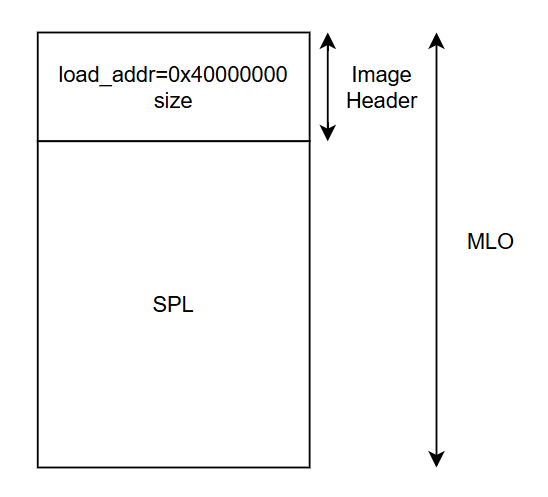
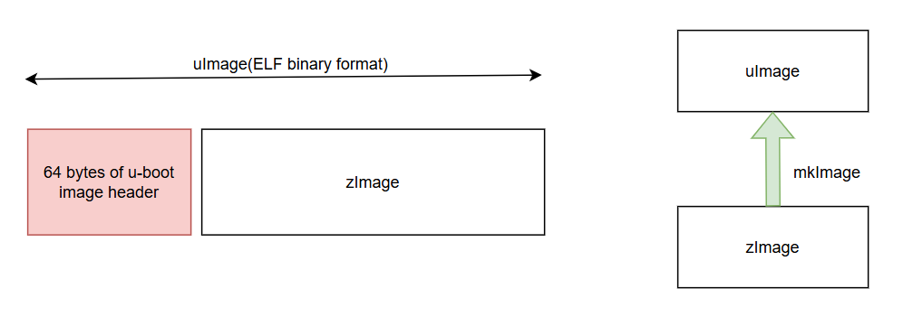
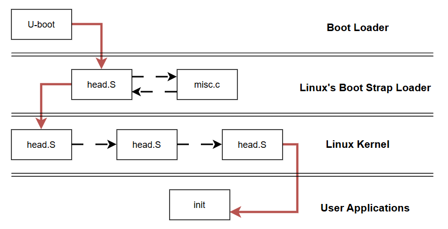
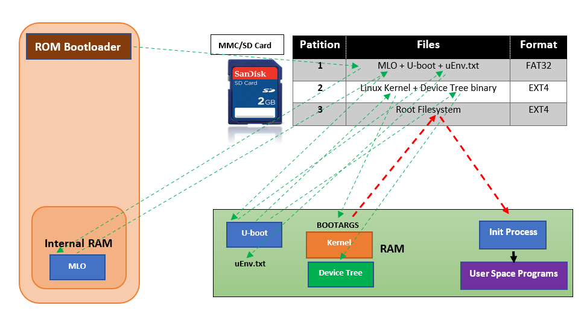

# Uboot

## I. Giới thiệu chung
- **U-Boot**(Das U-Boot) là một bootloader có mã nguồn mở được sử dụng rộng rãi trong các hệ thống nhúng nhỏ. Nó hỗ trợ sẵn cho các kiến trúc, bao gồm 68k, ARM, Blackfin, MicroBlaze, MIPS, Nios, SuperH, PPC, RISC-V và x86.

- Chức năng chính của nó là khởi tạo phần cứng và load các thành phần khác của OS (linux kernel, rootfs, device tree) lên RAM và trao quyền lại cho linux kernel.

- Ưu điểm của u-boot sở hữu dựa trên các nguyên tắc thiết kế mà nhà phát triển nó đặt ra, bao gồm:

    - Keep it Small
    - Keep it Fast
    - Keep it Simple
    - Keep it Configurable
    - Keep it Debuggable
    - Keep it Usable
    - Keep it Maintainable
    - Keep it Beautiful
    - Keep it Open

## II. Linux Boot Sequence


- Mức độ ưu tiên trong BootSequence
    - Boot Button được nhấn: SPI1>MMC0>USB0>UART0
    - Boot Button không được nhấn: MMC1>MMC0>UART0>USB

- Boot Proccess có thể chia thành nhiều giai đoạn (Stage). Tuy nhiên, thông thường sẽ chỉ gồm 2 giai đoạn chính là Single-Stage và Two-Stage.

- Tại sao lại phân chia ra Single-Stage/Two-Stage, thêm SPL vào làm gì, sao không load thẳng U-boot vào IRAM ngay từ đầu đi?
    - Một trong các lí do có thể kể tới đó chính là phụ thuộc vào từng nhà sản xuất và phần cứng. Có phần cứng chỉ cần sử dụng mã ROM là đã có thể load và khởi động u-boot. Tuy nhiên một số thiết bị khác yêu cầu phải sử dụng đến SPL.
    - Nguyên nhân chính đó chính là do sự giới hạn về IRAM. Giá thành của nó không hề rẻ nên giải pháp của nhà sx đó chính là tăng code và giảm IRAM
### 1. ROM Boot loader
- ROM Boot loader là một chương trình nhỏ được nhà sản xuất ghi vào ROM. 
- Nó được khởi chạy Khi hệ thống được khởi động hoặc bị reset
- Chức năng chính của RBL là sao chép nội dung trong  file MLO/SPL vào internal RAM và thực thi SPL
#### ROM code startup sequence

- Khởi tạo stack
- Cấu hình Watchdog timer trong 3 phút để load SPL
- cấu hình xung clock PLL

- Tìm kiếm trong Memory devices (MMC/eMMC, SDcard, NAND flash, ...) 
- Copy MLO/SPL vào Internal RAM 
- Thực thi MLO/SPL

### 2. Second Program Loader(SPL)
#### Cấu trúc file MLO

#### Chức năng của MLO
- Khởi tạo UART console để hiển thị debug messages lên màn hình 
- Cấu hình lại xung clock PLL
- khởi tạo DDR register để sử dụng DDR memory
- Cấu hình các ngoại vi khác cho u-boot
- Copy U-boot image vào DDR memory. Chuyển sang chế độ u-boot
### 3. U-boot
- Sau khi được load vào RAM, u-boot sẽ thực hiện việc relocation. Di dời đến địa chỉ relocaddr của RAM (Thường là địa chỉ cuối của RAM) và nhảy đến mã của u-boot sau khi di dời.
- Lúc này u-boot sẽ kiểm tra xem file uEnv.txt có tồn tại hay không. Nếu có thực hiện load nó vào RAM ở bước tiếp theo.

- Tiếp theo u-boot sẽ tiếp tục load kernel, device tree vào RAM tại các địa chỉ mà đã được cấu hình từ trước ở trong mã nguồn u-boot hoặc trong file uEnv.txt. Sau cùng nó sẽ truyền toàn bộ kernel parameters và nhường quyền thực thi lại cho kernel.


#### Chức năng chính của U-boot
- Khởi tạo ngoại vi như: I2C, UART, NAND, Flash,... để hỗ trợ load Kernel
- Load linux kernel image từ boot sources vào DDR memory của board.
- Boot sources: USB, eMMC, SDcard, ...
- Truyền các tham số boot vào kernel

#### uImage file format
- uImage (ELF binary format) là định dạng file kernel image đặc biệt được sử dụng trong U-Boot, một bootloader phổ biến cho các hệ thống nhúng (embedded systems).


#### U-boot linux image header
``` c
typedef struct image_header{

}image_header_t;
```
### 4. U-boot command
- document: `.\ubootcomand.pdf`
- Load the uImage from Memory device in to the DDR memory
``` shell
load mmc 0:2 0x82000000 /boot/uImage
```
- Memory display
``` shell
md 0x82000000 10
```
- Print information
``` shell
imi 0x82000000
```
### Control flow during linux boot


- clone u-boot source code : `git clone -b v2019.04 https://github.com/u-boot/u-boot --depth=1`
#### U-boot
- folder: `u-boot\arch\arm\lib\bootm.c`

#### Linux's Boot Strap Loader      
- folder: `u-boot\arch\boot\compressed\`
#### Linux Kernel
- folder: `u-boot\arch\arm\kernel\`
#### User Application
- folder: 
##### Tại sao phải thực hiện Relocation?

- Ở các giai đoạn trước của u-boot (ROM code or SPL). Chúng sẽ tải u-boot lên RAM mà không hề biết trước kế hoạch cho các vùng nhớ mà u-boot có thể tải lên là : bản thân u-boot, kernel-image, device tree, rootfs vv..
- Nó đơn giản load u-boot lên RAM ở một địa chỉ thấp. Sau đó khi u-boot thực hiện một số khởi tạo cơ bản và phát hiện hiện tại nó không nằm ở vị trí được lập kế hoạch, chức năng relocation di chuyển u-boot đến vị trí đã lên kế hoạch và nhảy tới nó.
- Bản chất việc relocation là để đảm bảo cho u-boot, kernel-image, device tree, rootfs vv.. khi load lên RAM sẽ không bị ghi đè lên nhau. Mà được load vào một vị trí tính toán từ trước.

### Linux Kernel
Sau khi nhận được quyền kiểm soát và các kernel parameters từ u-boot. Kernel sẽ thực hiện mount hệ thống file system (Rootfs) và cho chạy tiến trình Init trên RAM. Đây là tiến trình được chạy đầu tiên khi hệ thống khởi động thành công và chạy cho tới khi hệ thống kết thúc. Tiến trình Init sẽ khởi tạo toàn bộ các tiến trình con khác trên user space, các applications tương tác trực tiếp với người dùng. Lúc này, hệ thống của chúng ta đã hoàn toàn sẵn sàng cho việc sử dụng.



