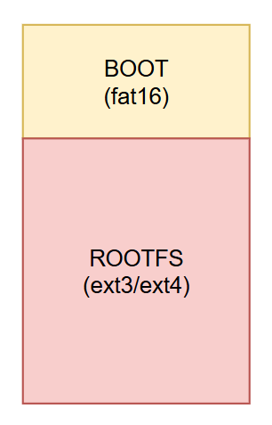

# Boot BBB over SDcard

## I. Partition SDcard using Gparted
### 1. Gparthed APP
### 2. Memory Partition

## II. Boot BBB over SDcard
- Install MLO, u-boot.img, uEvn.txt into BOOT partition
```shell
sudo cp -r MLO u-boot.img /media/BOOT 
```
- Install Rootfs file into ROOTFS partition
``` shell
sudo cp -r ./Rootfs /media/ROOTFS
```
- Nhấn Boot button và cấp nguồn board đến khi user led hiển thị 