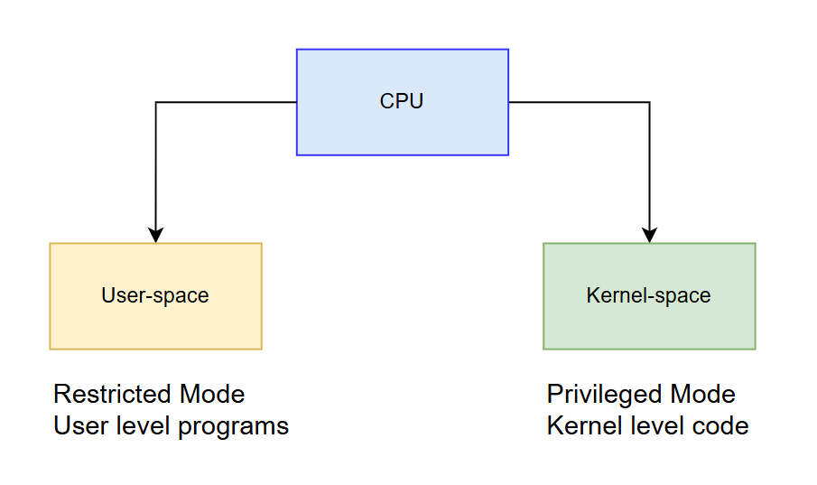
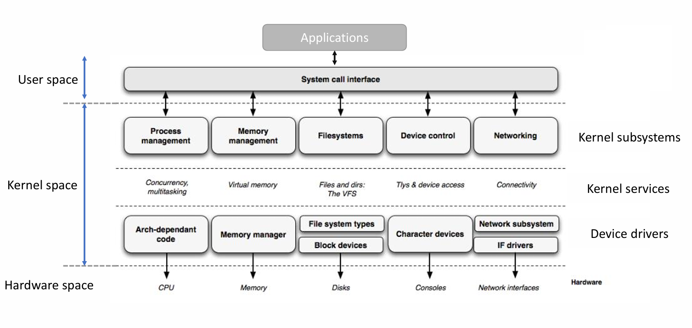

# Linux Kernel modules

## I. Giới thiệu chung
### 1. khái niệm cơ bản
- Linux hỗ trợ việc chèn và xóa mã động khỏi Kernel trong khi hệ thống đang hoạt động. Đoạn mã mà chúng ta thêm và xóa trong quá trình chạy được gọi là Linux Kernel Module (LKM)
- LKM mở rộng chức năng của nhân hệ điều hành một cách linh hoạt bằng cách bổ sung các tính năng mới vào nhân, chẳng hạn như bảo mật, trình điều khiển thiết bị, trình điều khiển hệ thống tập tin, các lệnh gọi hệ thống,... .
- LKM cho phép các hệ thống Linux nhúng chỉ cần kernel image tối thiểu (=>ít bộ nhớ, thời gian chạy hơn) và các trình điều khiển thiết bị tùy chọn cùng các tính năng khác được cung cấp theo yêu cầu thông qua việc chèn mô-đun.

### 2. Phân loại LKM
- Static Kernel module: là LKM được thể tích hợp kernel image(mô-đun trở thành một phần của Linux kernel image). Phương pháp này làm tăng kích thước của Linux kernel image khi hoàn tất. Nó không thể gỡ bỏ mô-đun => Static kernel module chiếm bộ nhớ vĩnh viễn trong thời gian chạy.
- Dynamic Kernel module: các mô-đun này không được tích hợp vào kernel image, mà thay vào đó chúng được biên dịch và liên kết riêng biệt để tạo ra các tệp `.ko`. Người dùng có thể tải và gỡ bỏ các module khỏi Kernel bằng cách sử dụng các lệnh như insmod, modprobe, rmmod.

<!-- ## I. tải phiên bản linux-kernel-header

``` shell
sudo apt install linux-headers-`uname -r`
``` -->
### 3. User-space and Kernel-space



- kernel module sẽ được thực thi trong kernel-space => chỉ có thể sử dụng các tệp kernel-Header, không bao giờ bao gồm bất kỳ tệp User-space header như C std lib .
- Hầu hết các tệp tiêu đề hạt nhân liên quan nằm trong `linux_source_base/include/linux`


### 4. In tree and out of tree
- Về cơ bản, out of tree module có nghĩa là các nodule nằm ngoài cây mã nguồn của nhân Linux (chưa được phê duyệt và có thể bị lỗi), biên dịch và liên kết nó với nhân khi đang chạy. `note` Kernel sex đánh dẫu nó thành  tainted

- Các mô-đun đã là một phần của nhân Linux được gọi là In tree module (được các nhà phát triển và người bảo trì nhân phê duyệt).

## II. Hello Kernel Module
``` C
#include <linux/module.h> 

/* This is module initialization entry point */
static int  __init my_kernel_module_init(void)
{
    pr_info(KERN_INFO "Hello world!\n");
    return 0;
}

/* This is module clean-up entry point */
static void  __exit my_kernel_module_exit(void)
{
    pr_info(KERN_INFO "Goodbye\n");
}

/* This is registration of above entry point with kernel */
module_init(my_kernel_module_init);
module_exit(my_kernel_module_exit);

/* This is decriptive information about the module */
MODULE_LICENSE("GPL"); 
MODULE_AUTHOR("Thuy");
MODULE_INFO(board, "beaglebone black");
MODULE_DESCRIPTION("A kernel module to print some messanges");  
MODULE_VERSION("v1.1");
```

- Các thành phần cơ bản trong một Kernel module
    - Header section
    - Code section
    - Registration section
    - Module description

### 1. Header Section
``` C
#include <linux/module.h>
```

### 2. Code section
``` C
/* This is module initialization entry point */
static int  __init my_kernel_module_init(void)
{
    pr_info(KERN_INFO "Hello world!\n");
    return 0;
}

/* This is module clean-up entry point */
static void  __exit my_kernel_module_exit(void)
{
    pr_info(KERN_INFO "Goodbye\n");
}
```
#### 2.1 Module initialization function
``` C
static int  __init my_kernel_module_init(void)
{
    pr_info(KERN_INFO "Hello world!\n");
    return 0;
}
```
- Phải trả về một giá trị
    - 0 là thành công
    -  khác 0 nghĩa là mô-đun khởi tạo thất bại

- Đối với Static Linux Kernel Module: Hàm này được gọi trong qua trình boot 
- Đối với Dynamic Linux Kernel Module: Hàm này được gọi trong quá trình chèn module

#### 2.2 Module Clean-up function
``` C
static void  __exit my_kernel_module_exit(void)
{
    pr_info(KERN_INFO "Goodbye\n");
}
```
- Clean-up function chỉ có tác dụng đối với Dynamic LKM
khi module loại bỏ khỏi kernel

<!-- - Nếu bạn viết một mô-đun và chắc chắn rằng nó sẽ luôn được liên kết tĩnh với nhân hệ điều hành, thì không cần thiết phải triển khai chức năng này. -->

<!-- - Ngay cả khi mô-đun tĩnh của bạn có chức năng dọn dẹp, hệ thống biên dịch hạt nhân vẫn sẽ loại bỏ nó trong quá trình biên dịch nếu có dấu hiệu thoát (__exit marker). -->
- Hàm này sẽ thực hiện ngược lại so với Module initialization function

#### 2.3 __init và __exit
``` C
#define __init          __section(.init.text)
#define __initdata      __section(.init.data)
#define __initconst     __section(.init.rodata)
```
``` C
#define __exit          __section(.exit.text)
```

### 3. Registration section
``` C
module_init(my_kernel_module_init);
module_exit(my_kernel_module_exit);
```
- module_init/module_exit là một macro được định nghĩa trong `linux/module.h` </br>
=> được sử dụng để đăng ký hàm khởi tạo và hàm dọn dẹp của module với nhân hệ điều hành.
### 4. Module description
``` C
MODULE_LICENSE(DRIVER_LICENSE); 
MODULE_AUTHOR(DRIVER_AUTHOR);
MODULE_INFO(NAME, "INFOR");
MODULE_DESCRIPTION(DRIVER_DESC);  
MODULE_VERSION(DRIVER_VERS);
```
- `MODULE_LICENSE(DRIVER_LICENSE)`: Khai báo giấy phép (license) của kernel module. Nếu không khai báo hoặc không tương thích, Kernel sẽ đánh dấu là tainted. 
- `MODULE_AUTHOR(DRIVER_AUTHOR)`: Khai báo tác giả của module.
- `MODULE_INFO(NAME, "INFOR")`: Cung cấp thông tin tùy chỉnh cho module dưới dạng cặp key–value, có thể xem bằng lệnh `modinfo`
- `MODULE_DESCRIPTION(DRIVER_DESC)`: Mô tả chức năng/ngữ nghĩa của kernel module.  
- `MODULE_VERSION(DRIVER_VERS)`: Khai báo phiên bản của module


## III. Build  kernel module
- Có hai cách build 
    - Statically linked against the kernel image(In tree)
    - Dynamically loadable(out of tree)

### 1. Dynamically loadable(out of tree)
- Command syntax
``` shell
make ARCH TOOLCHAIN -C $KERNEL_DIR M=$SRC_DIR [Targets]
```
#### 1.1 Targets
- `modules`: được đặt mặc định khi không được nhắc đến. có chức năng compile module.
- `modules_install`: Compile và Install externel module vào vị trí mặc định là `/lib/modules/<kernel_release>/extra/`. Có thể thêm tiền tố `INSTALL_MOD_PATH` chỉ định vị trí install module.
- `clean`: Xóa tất cả các tệp được tạo trong thư mục module.
- `help`: Liệt kê các mục tiêu khả dụng cho external module.

#### 1.2 Makefile
- Makefile là một tệp văn bản dùng bởi công cụ make để tự động hóa quá trình biên dịch và xây dựng phần mềm, đặc biệt phổ biến trong các dự án C/C++, nhưng cũng được dùng cho nhiều ngôn ngữ và workflow khác.
- Example: `./001_Hello_Kernel_Module/Makefile`

### 2. Statically linked against the kernel image
#### 1. Tạo folder trong thư mục /drivers/char/[name_folder]
#### 2. copy source file `.c` file vào folder đã tạo 
#### 3. tạo file /drivers/char/[name_folder]/Kconfig
```
menu "my custom modules"
    config CUSTOM_HELLOWORLD
        tristate "hello world module support"
        default n
endmenu
```
#### 4. sửa file /drivers/char/Kconfig
```
```
#### 5. Thêm /drivers/char/[name_folder]/Makefile
```
```
#### 6. Sửa file /drivers/char/Makefile
```
```
#### 7. Cấu hình menuconfig
```shell
make ARCH=arm CROSS_COMPILE=arm-linux-gnueabihf- menuconfig
```
- Chỉnh sửa
```
menuconfig > kernel hacking> my custom modules
```

<!-- /hom/user/.bashrc
/etc/sudoers -->
## IV. Debugging with printk
- Khi sử dụng **printk**, thông báo sẽ được đưa vào bộ đệm vòng của nhân hệ điều hành hay `Kernel log`. Có thể xem thông tin với lệnh `dmesg`
- **printk** không hỗ trợ định dạng dấu chấm động(`%e`, `%f`, `%g`).
#### Command syntax
``` C
printk(LOG_LEVEL "LOG_MESSAGE");
```
### Kernel log levels
``` C
#define KERN_SOH	"\001"		/* ASCII Start Of Header */
#define KERN_SOH_ASCII	'\001'

#define KERN_EMERG	KERN_SOH "0"	/* system is unusable */
#define KERN_ALERT	KERN_SOH "1"	/* action must be taken immediately */
#define KERN_CRIT	KERN_SOH "2"	/* critical conditions */
#define KERN_ERR	KERN_SOH "3"	/* error conditions */
#define KERN_WARNING	KERN_SOH "4"	/* warning conditions */
#define KERN_NOTICE	KERN_SOH "5"	/* normal but significant condition */
#define KERN_INFO	KERN_SOH "6"	/* informational */
#define KERN_DEBUG	KERN_SOH "7"	/* debug-level messages */

#define KERN_DEFAULT	KERN_SOH ""	/* the default kernel loglevel */
```
- khi không đề cập đến chỉ LOG_LEVEL thì nó sẽ mang giá trị mặc định `CONFIG_CONSOLE_LOGLEVEL_DEFAULT`
- Có thể chỉnh sửa Kernel log level default bằng cách chỉnh sửa file ``/proc/sys/kernel/printk``
``` shell
echo value > /proc/sys/kernel/printk
```

## V. Command
### 1. Install module
``` shell
insmod main.ko
```
### 2. Remove moudule
``` shell
rmmod main.ko
```
- Gỡ module + dependency liên quan
``` shell
modprobe -r main
```
### 3. Print module information
``` shell
modinfor main.ko
```
- Hiển thị: filename, license, author, description, version, vermagic, dependency
### 4. Log and debug kernel module 
``` shell
dmesg
```
### 5. Load module into target
``` shell
ssh debian@192.168.7.2
scp main.ko debian@192.168.7.2:/home/debian/drivers
```
- copy main.ko vào /home/debian/drivers của beaglebone black
## Docs
- [Print-format](https://www.kernel.org/doc/html/latest/core-api/printk-formats.html): `../docs/printk-formats.txt`
- [Building External Modules](https://www.kernel.org/doc/Documentation/kbuild/modules.txt): `../docs/Building_External_Modules.txt`
- [Kconfig-language document](https://www.kernel.org/doc/Documentation/kbuild/kconfig-language.txt): `../docs/Kconfig_Language.txt`
