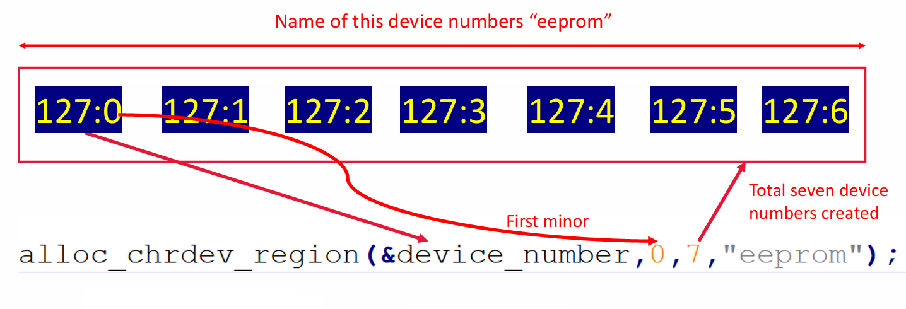

# Character Driver
## I. khái niệm
- Character Device File là một loại tệp đặc biệt trong hệ điều hành Unix/Linux dùng để giao tiếp với thiết bị phần cứng theo kiểu truyền dữ liệu từng ký tự (byte) một cách tuần tự.
- Các thiết bị được đại diện bởi các tệp đặc biệt trong thư mục
### Chuẩn cấu trúc Character Device
## II. Device number
- Device number: là các giá trị số nguyên được sử dụng để nhận diện và quản lý các thiết bị (devices) trong hệ thống, đặc biệt là trong giao tiếp với kernel thông qua các tệp đặc biệt trong thư mục.
- Nó bao gồm major number và minor number:
  - Major number: Xác định loại Kernel driver nào phụ trách tương tác thiết bị
  - Minor Number: phân biệt giữa các thiết bị cùng sử dụng chung 1 driver

- Macro xác định major_number(12 bit) và minor_number(20 bit) thông qua device_number(dev_t => uint32_t) nằm trong thư viện`linux/kdev_t.h`
``` C
dev_t device_number;
int minor_no = MINOR(device_number);
int major_no = MAJOR(device_number);
```
- ghép major_number và minor_number thành device_number 
```C
MKDEV(int major, int minor);
```
### 1. Allocate device number
- Cấp phát device number có thể sử dụng một trong hai cách:
- Cấp phát device number. Phương thức cấp phát cho device number nằm trong thư viện: `linux/fs.h`

``` C
/**
 * @brief: một hàm trong Linux Kernel dùng để đăng ký ngả (range) số thiết bị ký tự một cách động, thay vì phải chỉ định cố định major number trong mã nguồn
 * dev_t *dev	Con trỏ tới biến dev_t để nhận kết quả: chứa cả major và minor đầu tiên.
 * baseminor	Số minor đầu tiên trong dải bạn muốn cấp (thường là 0).
 * count	Số lượng thiết bị ký tự (số minor number) bạn cần cấp.
 * name	Tên chuỗi để hiển thị trong /proc/devices hoặc các công cụ chẩn đoán.
 **/
int alloc_chrdev_region(dev_t *dev, unsigned baseminor, unsigned count, const char *name);
```



### 2. Hủy cấp phát  
``` C
/**
 * @brief: hàm kernel dùng để hủy đăng ký (giải phóng) vùng số thiết bị (device number region) mà bạn đã cấp phát trướ
 * @param[in]: from đại diện cho major & minor bắt đầu (thường được trả về bởi alloc_chrdev_region() hoặc tạo bằng MKDEV(major, minor))
 * @param[in]: count: Số lượng minor number bạn muốn hủy đăng ký (giống như lúc bạn đã đăng ký)
**/
void unregister_chrdev_region(dev_t from, unsigned count);
```
## III. Register character driver file operation methods
- `linux/cdev.h`
### 1. Struct cdev

#### THIS_MODULE
- THIS_MODULE là một macro trong Linux kernel, dùng bên trong mã kernel module để chỉ chính module hiện tại.
- `linux/export.h`

### 2. Initialize a cdev structure
``` C
/**
 * @brief: khởi tạo một cấu trúc cdev
 * @param[in]cdev: Con trỏ tới struct cdev (biến đại diện cho thiết bị ký tự).
 * @param[in]fops: Con trỏ tới cấu trúc file_operations chứa các hàm xử lý file operations như open, read, write...
*/
void cdev_init(struct cdev *cdev, const struct file_operations *fops);
```


###
- Trong Linux, bạn có thể tạo tệp thiết bị một cách động (theo yêu cầu), tức là bạn không cần phải tự tạo các tệp thiết bị trong thư mục /dev để truy cập phần cứng của mình.

- Chương trình cấp người dùng như udevd có thể điền các tệp thiết bị vào thư mục /dev một cách động.
- Chương trình udev lắng nghe các sự kiện uevents được tạo ra bởi các sự kiện cắm nóng hoặc các mô-đun kernel.

Khi udev nhận được các sự kiện uevents, nó sẽ quét các thư mục con của /sys/class để tìm các tệp 'dev' để tạo tệp thiết bị.

- Đối với mỗi tệp 'dev' như vậy, đại diện cho sự kết hợp của số chính và số phụ cho một thiết bị, chương trình udev sẽ tạo một tệp thiết bị tương ứng trong thư mục /dev.


### II. chuẩn cấu trúc của Character Device Driver

#### 1. Allocate device number (major/minor)


 

#### 2. Register File operations
- Register File operations bao gồm các hoạt động của người dùng trên file như open, close, read, write, leek, ...
##### i khởi tạo cấu trúc file operations
- file_operations là một cấu trúc dữ liệu trong Linux kernel, định nghĩa các hàm callback cho driver khi user-space thao tác với thiết bị (file descriptor). 
``` C
/*  Function Prototypes */
static int      m_open(struct inode *inode, struct file *file);
static int      m_release(struct inode *inode, struct file *file);
static ssize_t  m_read(struct file *filp, char __user *user_buf, size_t size,loff_t *offset);
static ssize_t  m_write(struct file *filp, const char *user_buf, size_t size, loff_t *offset);

/* file_operations structure */
static struct file_operations fops =
{
    .owner      = THIS_MODULE, /* Mặc định */ 
    .read       = m_read,
    .write      = m_write,
    .open       = m_open,
    .release    = m_release,
};
```
  - m_read, m_write, m_open, m_release là những hàm callback khi user-space tương tác với device file 
     - Khi user-space gọi read() (ví dụ: cat /dev/mydevice), kernel sẽ gọi hàm m_read().
     - Khi user-space gọi write() (ví dụ: echo "data" > /dev/mydevice), kernel sẽ gọi m_write().
     - Khi thiết bị được mở (ví dụ: open("/dev/mydevice", O_RDWR)), kernel sẽ gọi m_open().
     - Khi thiết bị được đóng (close()), kernel sẽ gọi m_release().

#### 3. khởi tạo Character Device 
##### i. Cấu trúc Character Device
``` C
struct cdev m_cdev;
```
##### ii. Gán file operaions cào Character Device

##### iii. Adding character device to the system
``` C
int cdev_add(struct cdev *p, dev_t dev, unsigned count);
/**
 * @brief: đăng ký character device vào hệ thống thiết bị (device model) của Linux.
 * @param[in] p: Con trỏ tới struct cdev đã được khởi tạo (thường bằng cdev_init()).
 * @param[in] dev: Số thiết bị (device number), thường là kết quả của MKDEV(major, minor), hoặc alloc_chrdev_region() cấp
 * @param[in] count: Số lượng minor devices mà driver này quản lý bắt đầu từ dev. Thường là 1 cho driver đơn giản. 
 * @retval: < 0 false
*/
```
#### 3. Device File
- tạo một file đặc biệt trong thư mục /dev/ đại diện cho một thiết bị phần cứng hoặc thiết bị ảo trong hệ thống Linux.
##### i. Class device
- Khởi tạo Class device
``` C
struct class *class_create(struct module *owner, const char *name);
/**
 * @brief: tạo một "class" thiết bị trong /sys/class, nhằm hỗ trợ việc tạo device node tự động trong /dev
 * @param[in] owner: Thường là THIS_MODULE, chỉ ra module nào sở hữu class này. 
 * @param[in] name: Tên class, sẽ hiển thị trong /sys/class/<name>/.
 * @retval: == NULL -> false
*/
```
- thu hồi Class device
``` C
device_destroy(mdev.m_class, mdev.dev_num);
```

##### ii. Device file
``` C
struct device *device_create(struct class *class, struct device *parent,
                             dev_t devt, void *drvdata, const char *fmt, ...);
/**
 * @param[in] class:	Con trỏ tới class mà bạn đã tạo từ class_create().
 * @param[in] parent:	Thiết bị cha, thường là NULL nếu không có.
 * @param[in] devt:	Device number (dev_t), chứa major và minor number
 * @param[in] drvdata:	Con trỏ dữ liệu riêng của driver, có thể là NULL hoặc struct của bạn.
 * @param[in] fmt: , ...	Format string để đặt tên thiết bị (ví dụ "mydevice%d", ...)
*/
```

``` C
device_destroy(mdev.m_class, mdev.dev_num);
```
