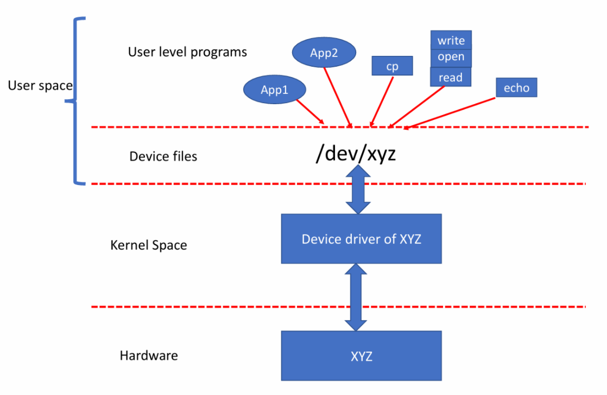
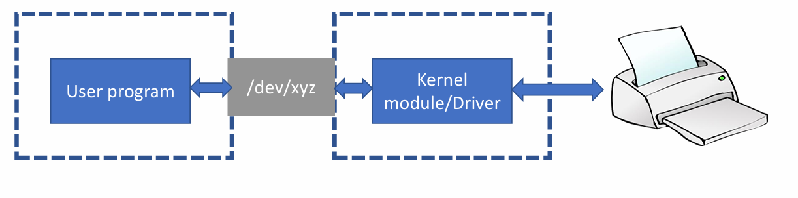

# Device driver
## 1. Giới thiệu chung
- Device driver(Trình điều khiển thiết bị) là một đoạn mã dùng để cấu hình và quản lý thiết bị.

- Mã trình điều khiển thiết bị biết cách cấu hình thiết bị, gửi dữ liệu đến thiết bị và biết cách xử lý các yêu cầu phát sinh từ thiết bị.

- Khi mã trình điều khiển thiết bị được tải vào hệ điều hành như Linux, nó sẽ cung cấp các giao diện cho không gian người dùng để ứng dụng người dùng có thể giao tiếp với thiết bị.

- Nếu không có trình điều khiển thiết bị, hệ điều hành/ứng dụng sẽ không có cái nhìn rõ ràng về cách xử lý thiết bị.

- Trình điều khiển thiết bị đảm nhận việc tương tác với các thiết bị phần cứng và xuất ra các giao diện mà các ứng dụng và các mô-đun khác của nhân hệ điều hành có thể sử dụng để truy cập các thiết bị.

- Phân loại device driver
    - Character driver
    - Block driver
    - Network driver
### Character driver
- Character driver truy cập dữ liệu từ thiết bị theo trình tự theo từng byte một (giống như một luồng ký tự)
- Character device bao gồm: cảm biến, RTC, bàn phím, cổng nối tiếp, cổng song song, v.v.

### Block driver

### Network driver

## Device file

