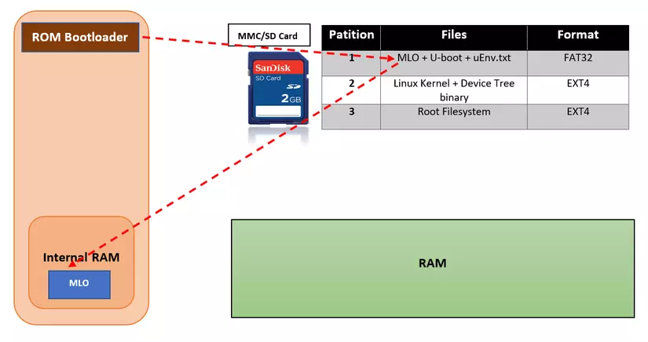
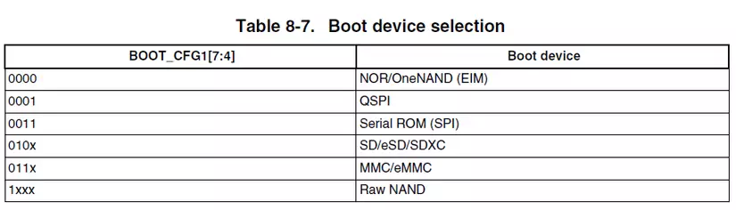
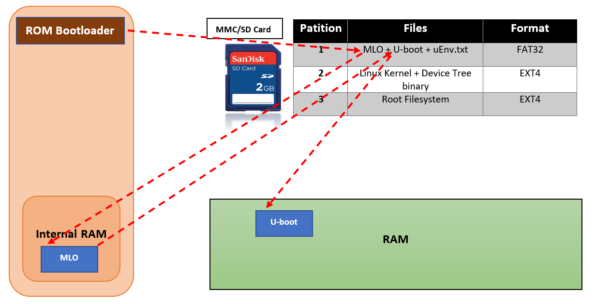
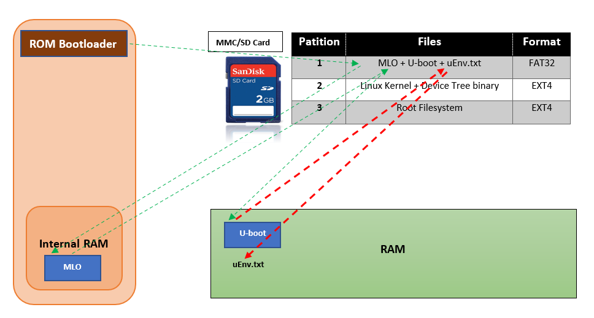
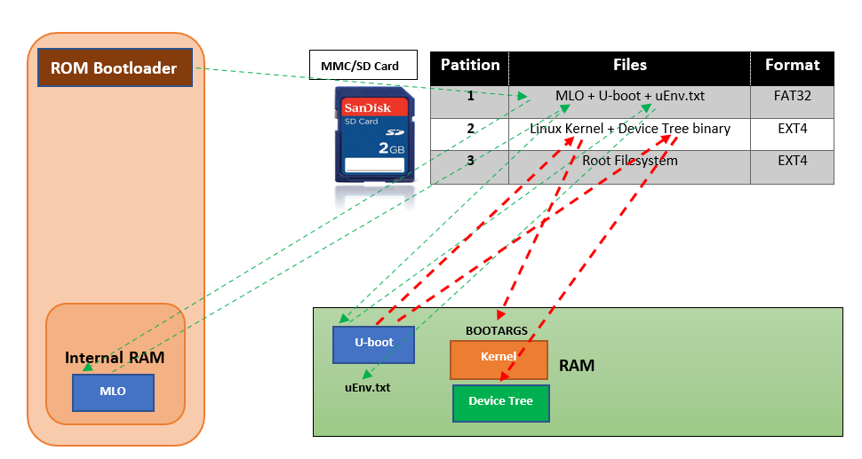
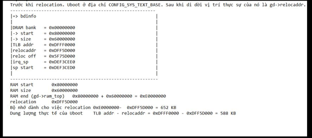

# Uboot

## I. Giới thiệu chung
- **Das U-Boot** (hay còn được gọi tắt là u-boot) là một bootloader có mã nguồn mở được sử dụng rộng rãi trong các hệ thống nhúng nhỏ. Nó hỗ trợ sẵn cho các kiến trúc, bao gồm 68k, ARM, Blackfin, MicroBlaze, MIPS, Nios, SuperH, PPC, RISC-V và x86.

- Chức năng chính của nó là khởi tạo phần cứng và load các thành phần khác của OS (linux kernel, rootfs, device tree) lên RAM và trao quyền lại cho linux kernel.

- Ưu điểm của u-boot sở hữu dựa trên các nguyên tắc thiết kế mà nhà phát triển nó đặt ra, bao gồm:

    - Keep it Small
    - Keep it Fast
    - Keep it Simple
    - Keep it Configurable
    - Keep it Debuggable
    - Keep it Usable
    - Keep it Maintainable
    - Keep it Beautiful
    - Keep it Open

## II. Boot Process
- Boot Proccess có thể chia thành nhiều giai đoạn (Stage). Tuy nhiên, thông thường sẽ chỉ gồm 2 giai đoạn chính là Single-Stage và Two-Stage.

- Tại sao lại phân chia ra Single-Stage/Two-Stage, thêm SPL vào làm gì, sao không load thẳng U-boot vào IRAM ngay từ đầu đi?

    - Một trong các lí do có thể kể tới đó chính là phụ thuộc vào từng nhà sản xuất và phần cứng. Có phần cứng chỉ cần sử dụng mã ROM là đã có thể load và khởi động u-boot. Tuy nhiên một số thiết bị khác yêu cầu phải sử dụng đến SPL.
    - Nguyên nhân chính đó chính là do sự giới hạn về IRAM. Giá thành của nó không hề rẻ. Mà với tiêu chí của người dùng "Rẻ là đã ngon rồi 😆" nên giải pháp của nhà sx đó chính là tăng code và giảm IRAM

### 1. Quá trình mô tả của Two-Stage
#### 1. Soc ROM Bootloader
- Khi hệ thống khởi động lần đầu tiên, hoặc reset. Quyền kiểm soát hệ thống sẽ thuộc về reset vector, nó là một đoạn mã assembly được ghi trước bởi nhà sản xuất chip (Manufaturer). Sau đó reset vector sẽ trỏ tới địa chỉ vùng nhớ chứa các đoạn mã khởi động đầu tiên, cụ thể là boot rom.

- Chức năng chính của boot rom đấy chính là sao chép nội dung trong file "MLO" hay còn được gọi là Second Program Loader (SPL) vào phần internal RAM
- Do bộ nhớ của boot rom khá nhỏ nên rom code cũng được giới hạn ở việc khởi tạo một số phần cứng cần thiết cho việc load SPL lên hệ thống như: MMC/eMMC, SDcard, NAND flash. Các phần cứng này được gọi chung là boot device.

- Rom code lựa chọn boot device (load từ thẻ nhớ, flash vv..) phụ thuộc vào việc cấu các pin thông qua switch/jump trên phần cứng.

#### 2. Second Program Loader (SPL)
- Nhiệm vụ chính của SPL đó chính là tiếp tục setup các thành phần cần thiết như DRAM controler, eMMC vv.. Sau đó load U-boot tới địa chỉ **CONFIG_SYS_TEXT_BASE** của RAM.

#### 3. U-Boot
- Sau khi được load vào RAM, u-boot sẽ thực hiện việc relocation. Di dời đến địa chỉ relocaddr của RAM (Thường là địa chỉ cuối của RAM) và nhảy đến mã của u-boot sau khi di dời.
- Lúc này u-boot sẽ kiểm tra xem file uEnv.txt có tồn tại hay không. Nếu có thực hiện load nó vào RAM ở bước tiếp theo.
- uEnv.txt là một bootscript, nó định nghĩa các tham số cấu hình, kernel parameters. Các tham số này mặc định đã được cấu hình trong u-boot. Tuy nhiên chúng ta có thể thêm, sửa, xóa các cấu hình này thông qua file uEnv.txt. Việc load uEnv.txt là một sự tùy chọn (Optional)

- Tiếp theo u-boot sẽ tiếp tục load kernel, device tree vào RAM tại các địa chỉ mà đã được cấu hình từ trước ở trong mã nguồn u-boot hoặc trong file uEnv.txt. Sau cùng nó sẽ truyền toàn bộ kernel parameters và nhường quyền thực thi lại cho kernel.

##### Vị trí của Uboot
- Sử dụng lệnh bdinfo trong trong u-boot command line

 

##### Tại sao phải thực hiện Relocation?

- Ở các giai đoạn trước của u-boot (ROM code or SPL). Chúng sẽ tải u-boot lên RAM mà không hề biết trước kế hoạch cho các vùng nhớ mà u-boot có thể tải lên là : bản thân u-boot, kernel-image, device tree, rootfs vv..
- Nó đơn giản load u-boot lên RAM ở một địa chỉ thấp. Sau đó khi u-boot thực hiện một số khởi tạo cơ bản và phát hiện hiện tại nó không nằm ở vị trí được lập kế hoạch, chức năng relocation di chuyển u-boot đến vị trí đã lên kế hoạch và nhảy tới nó.
- Bản chất việc relocation là để đảm bảo cho u-boot, kernel-image, device tree, rootfs vv.. khi load lên RAM sẽ không bị ghi đè lên nhau. Mà được load vào một vị trí tính toán từ trước.

### Linux Kernel
Sau khi nhận được quyền kiểm soát và các kernel parameters từ u-boot. Kernel sẽ thực hiện mount hệ thống file system (Rootfs) và cho chạy tiến trình Init trên RAM. Đây là tiến trình được chạy đầu tiên khi hệ thống khởi động thành công và chạy cho tới khi hệ thống kết thúc. Tiến trình Init sẽ khởi tạo toàn bộ các tiến trình con khác trên user space, các applications tương tác trực tiếp với người dùng. Lúc này, hệ thống của chúng ta đã hoàn toàn sẵn sàng cho việc sử dụng.

