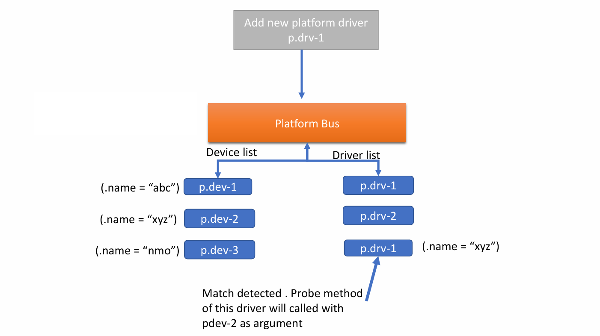
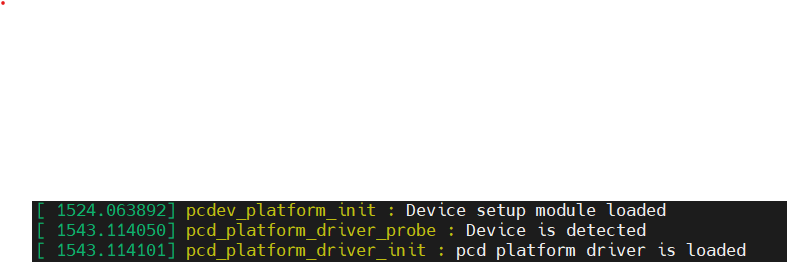
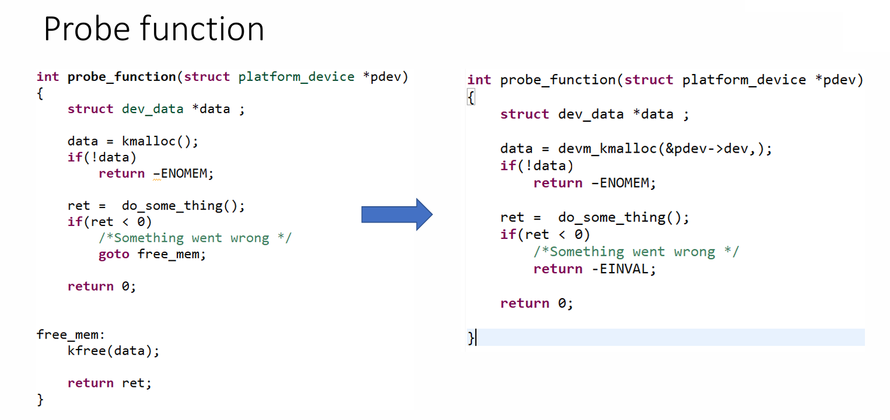

# platform device driver (Legacy)
## I. Giới thiệu chung
- Platform device/driver được dùng để phát hiện thiết bị
## II. Platform device
### 1. Platform device header file
- linux/platform_device.h

### 2. Data Struct 
- ``struct platform_device`` dùng để mô tả hardware device cố định trên SOC
``` C
struct platform_device {
    const char      *name;      // tên platform device
    int             id;         // phân biết nhiều platform device khi cùng tên 
    struct device   dev;
    u32             num_resources;
    struct resource *resource;
};
```
- ``struct device`` 
``` C
// Các trường quan trọng của device đối với platform device
.dev = {
    .platform_data = &platform_pdata,   // dữ liệu/dữ liệu tự tạo được đưa vào probe()
    .release = platform_release         // hàm thoát khi device device release
}

void pcdev_release(struct device *dev)
{}
```
### 3. API
#### platform_device_register và platform_device_unregister
- Đăng ký một platform_device và platform_bus 
``` C
int platform_device_register(struct platform_device *pdev);
```
- Hủy đăng ký platform_device
``` C
int platform_device_unregister(struct platform_device *pdev);
```
<br>

- ``note:`` Khi device được đăng ký kernel tự động tạo folder chứa thông tin của device tại `/sys/devices/platform/"platform_device.name"`  

### 4. Example
- pseudo device setup
``` C
// pcd_device_setup.c
#include<linux/module.h>
#include<linux/platform_device.h>

#undef pr_fmt
#define pr_fmt(fmt) "%s : " fmt,__func__

void pcdev_release(struct device *dev)
{
    pr_info("Device released \n");
}

struct platform_device pcdev_1 = {
    .name = "pcd-1",
    .id = 0,
    .dev = {
        .release = pcdev_release
    }
};

static int __init pcdev_platform_init(void)
{
    platform_device_register(&pcdev_1);
    pr_info("Device setup module loaded\n");
    return 0;
}

static void __exit pcdev_platform_exit(void)
{
    platform_device_unregister(&pcdev_1);
    pr_info("Device setup module unloaded\n");
}

module_init(pcdev_platform_init);
module_exit(pcdev_platform_exit);

MODULE_LICENSE("GPL");
MODULE_AUTHOR("THUY");
```
## III. Platform driver 
### 1. Data struct
- `struct platform_driver`
``` C
struct platform_driver {
    int (*probe)(struct platform_device *);
    int (*remove)(struct platform_device *);

    void (*shutdown)(struct platform_device *);
    int (*suspend)(struct platform_device *, pm_message_t state);
    int (*resume)(struct platform_device *);

    struct device_driver driver;
};
```
- `struct device_driver`
``` C
struct device_driver {
    const char              *name; // tên device_driver
    const struct bus_type   *bus;
    struct module           *owner;

    const struct of_device_id *of_match_table;

    int (*probe)(struct device *dev);
    int (*remove)(struct device *dev);

    struct driver_private *p;
};
```
### 2. API
``` C
platform_driver_register();
platform_driver_unregister();
```
- `note:` khi register thành công driver sẽ được add vào `/sys/bus/platform/drivers/"driver.name"`
### 3. Example
``` C

```

## IV. Quá trình matching device và driver
- khi device và driver được insmod vào hệ thống. Kernel match device và driver bằng cách so sánh device.name và driver.name
- Khi quá trình matching thành công (device.name = driver.name) hàm probe() trong driver sẽ được call 


độ ưu tiên matching
dtb
id matching
name matching


## V. Kernel memory allocation APIs
- Trong kernel-space, Ta không thể sử dụng được các hàm cấp phát của user-space(malloc, calloc, realoc, free) mà phải sử dụng các hàm riêng cho kernel-space.
### kmalloc
- Được sử dụng để phân bổ bộ nhớ trong không gian kernel bởi các trình điều khiển và các hàm kernel.
- Bộ nhớ được cấp phát là liền kề về mặt vật lý (RAM).
``` C
/**
 * @return: NULL if allocation fails, on success virtual address of the first page allocated
*/
void* kmalloc( size_t size, gfp_t flags);
```
- `gfp_t flags`: thay đổi hành vi của bộ cấp phát bộ nhớ cơ bản
    - GFP_KERNEL: Phân bổ bộ nhớ RAM kernel thông thường. Khi thiếu bộ nhớ tiến trình này có thể giám đoạn hoặc sleep. Không được dùng trong interrupt
    - GFP_ATOMIC: Việc phân bổ sẽ không bị gián đoạn. Có thể sử dụng các nguồn dự phòng khẩn cấp. được dùng trong interrupt
### kfree
- Giải phòng bộ nhớ đã được cấp phát trước đó
``` C
void kfree(const void *objp);
```
### kmalloc and friends
kzalloc()
krealloc()
kmalloc_array()
kcalloc()

### Resource managed kernel APIs
- Trong Linux kernel, Resource-managed APIs (thường gọi là devres APIs) là cơ chế để kernel tự động quản lý resource lifecycle của driver.
- Mục tiêu:
    - giảm memory leak
    - giảm cleanup code
    - tránh quên free resource khi probe fail
    - đơn giản hóa driver remove path

#### Example

- demv_kmalloc() tương ứng với kmalloc() và nó không cần quan tâm đến việc giải phóng bộ nhớ(kfree()).
- [danh sách các devres APIs](https://www.kernel.org/doc/Documentation/driver-model/devres.txt)


