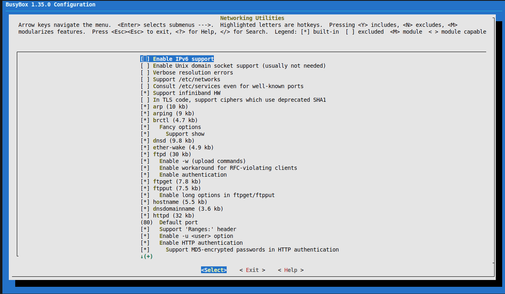
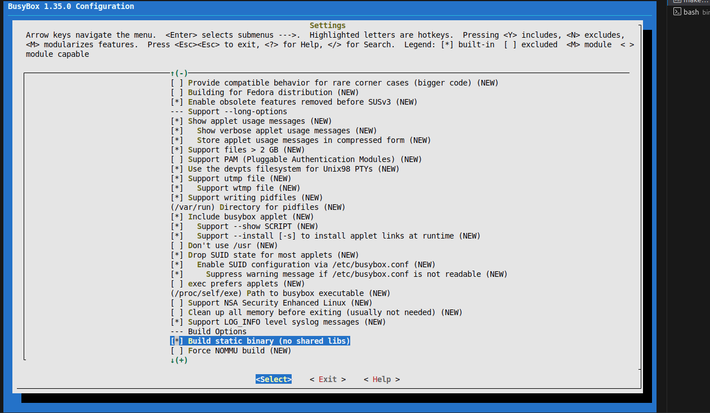
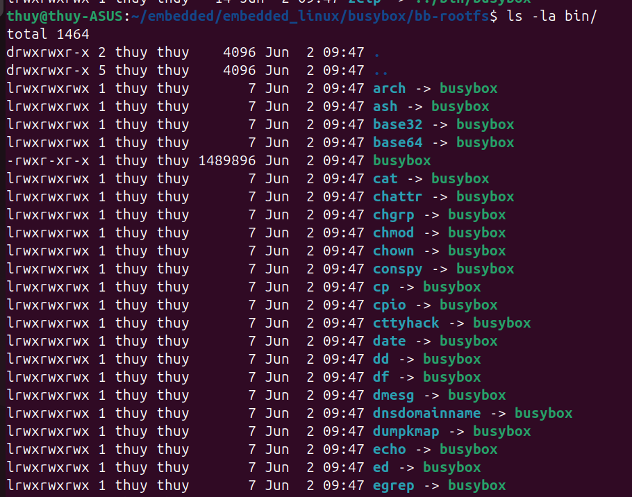
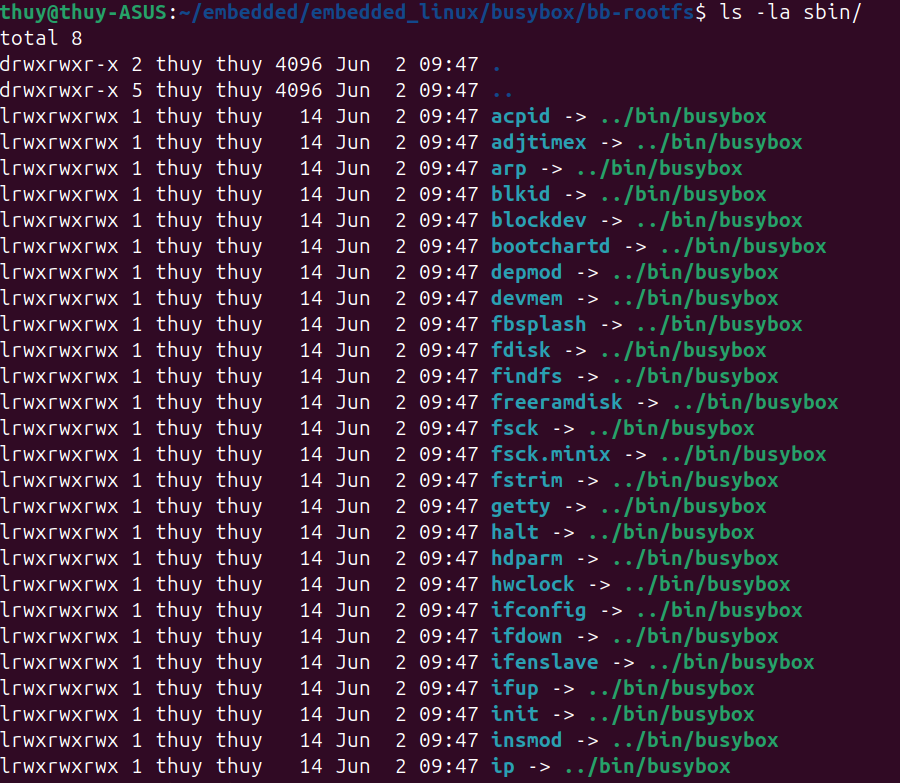

# Minimaze root file system using busybox
## I. GIới thiệu chung
- BusyBox là một bộ công cụ dòng lệnh nhỏ gọn cho Linux/Unix, được thiết kế để tích hợp nhiều lệnh cơ bản vào trong một file thực thi duy nhất.

- BusyBox cung cấp các lệnh hệ thống quen thuộc như:
    - ls, cp, mv, rm
    - cat, echo, grep
    - ps, top, kill
    - mount, ifconfig, ping
    - sh (shell)

<br>
👉 Tất cả các lệnh này dùng chung một binary duy nhất, thay vì mỗi lệnh là một chương trình riêng như trong GNU coreutils.

- BusyBox được thiết kế để:
    - Nhẹ (rất nhỏ về dung lượng)
    - Tiết kiệm bộ nhớ
    - Chạy tốt trên hệ thống hạn chế tài nguyên

- BusyBox thường được dùng trong:
    - Hệ thống embedded (router, IoT, camera)
    - Initramfs / initrd
    - Docker container siêu nhẹ
    - Android (phiên bản hệ thống cơ bản)

## II. Busybox source code

## III. Minimaze rootfs sử dụng busybox
- Tạo cấu trúc folder rootfs
``` sh
user@ubuntu:./$ mkdir rootfs
user@ubuntu:./rootfs$ sudo mkdir bin dev etc home lib proc sbin sys tmp usr var && sudo mkdir usr/bin usr/lib usr/sbin var/log
user@ubuntu:./rootfs$ tree -d
.
├── bin
├── dev
├── etc
├── home
├── lib
├── proc
├── sbin
├── sys
├── tmp
├── usr
│   ├── bin
│   ├── lib
│   └── sbin
└── var
    └── log
 
15 directories
```
- Download source code: [`busybox`](https://busybox.net/downloads) 
- Clone source code from github
``` shell
# user@ubuntu:./$
git clone -b 1_35_0 git://busybox.net/busybox.git busybox-1-35-0
```
- Xóa toàn bộ các cài đặt trước đó
``` shell
# user@ubuntu:./busybox-1-35-0$
make distclean
```
- uild default config cho busybox
```shell
# user@ubuntu:./busybox-1-35-0$
make ARCH=arm CROSS_COMPILE=arm-linux-gnueabihf- defconfig
```
- Run menuconfig
``` shell
# user@ubuntu:./busybox-1-35-0$
make ARCH=arm CROSS_COMPILE=arm-linux-gnueabihf- menuconfig
```
- Chọn opption trong menuconfig




- Install minimal rootfs into the rootfs path.
``` shell
# user@ubuntu:./busybox-1-35-0$
make ARCH=arm CROSS_COMPILE=arm-linux-gnueabihf- CONFIG_PREFIX=#<PATH>/rootfs install
```
- Kiểm tra kết quả rootfs 




