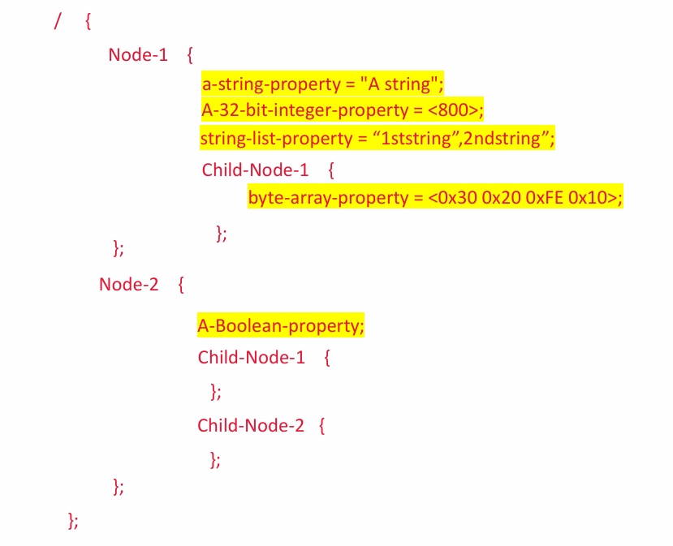
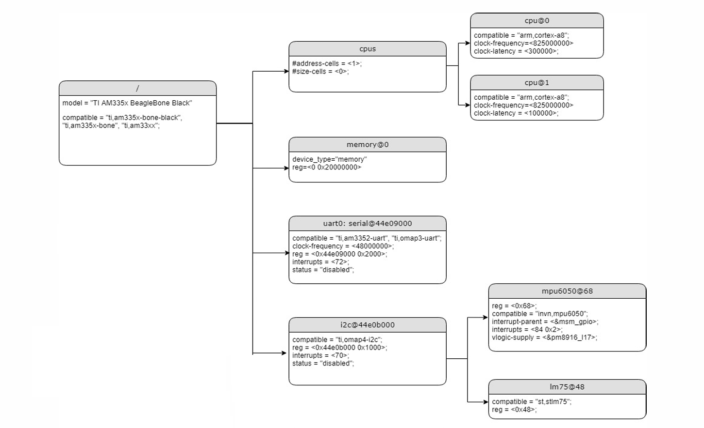
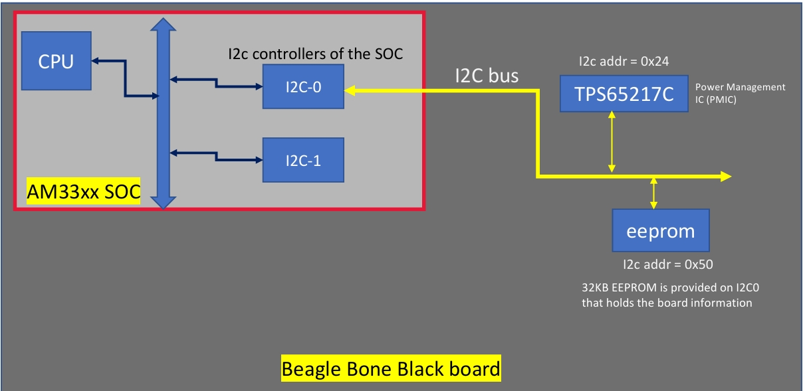
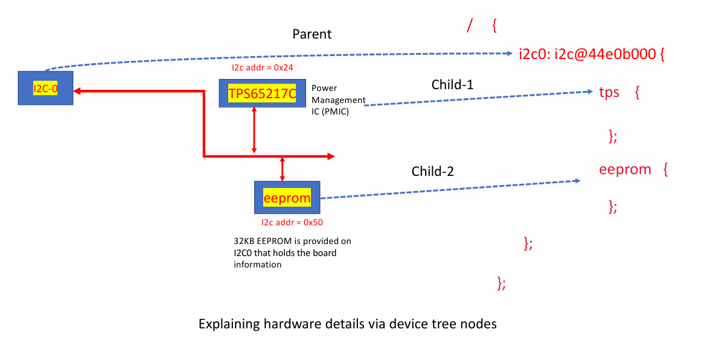

# Device tree

## Introduction to the device tree

## Device tree structure

root node
### device tree syntax
- documemts : [Device tree specification release v0.3](device)
#### Node name
#### Node label
#### Standard and non-standard property names
#### Data type representation

## Example of device tree node

## Device tree overlays

